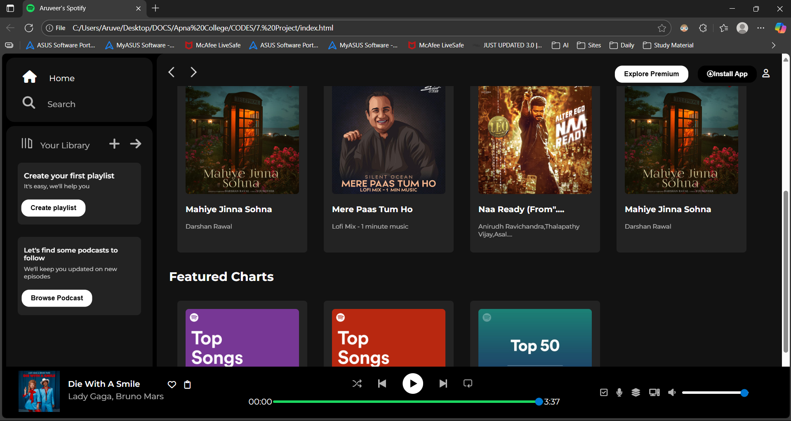

# 🎵 Spotify Clone  

A simple **Spotify Clone** built using HTML, CSS, and JavaScript.    
This project replicates the look and feel of Spotify’s web player UI.   

--- 

## 🚀 Features  
- 🎶 Music player with play/pause functionality  
- 📂 Organized assets (images, icons, songs)  
- 📱 Responsive design (works on mobile & desktop)  
- 🎨 Modern Spotify-inspired UI  

---

## 📂 Project Structure  
spotify-clone/     
│── index.html        
│── style.css        
│── script.js       
│── /images      
│ ├── logo.png        
│ ├── song1.png         
│ └── ...           
       

---

## 🖼 Screenshots  
      

  

---
🙌 Acknowledgements 

Inspired by Spotify’s web player design.

Built as a learning project in Web Development.        


## ⚙️ How to Run  
Clone this repo:  
   ```bash
   git clone https://github.com/Aruveer/spotify-clone.git


